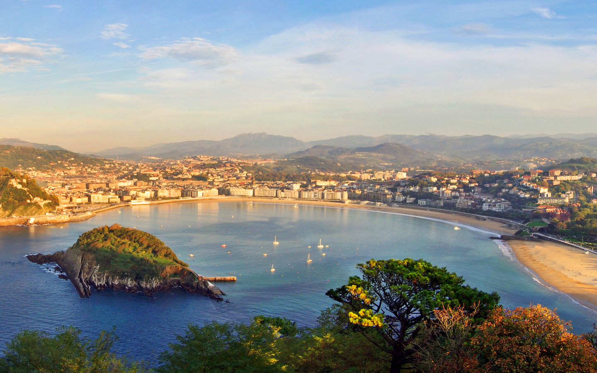
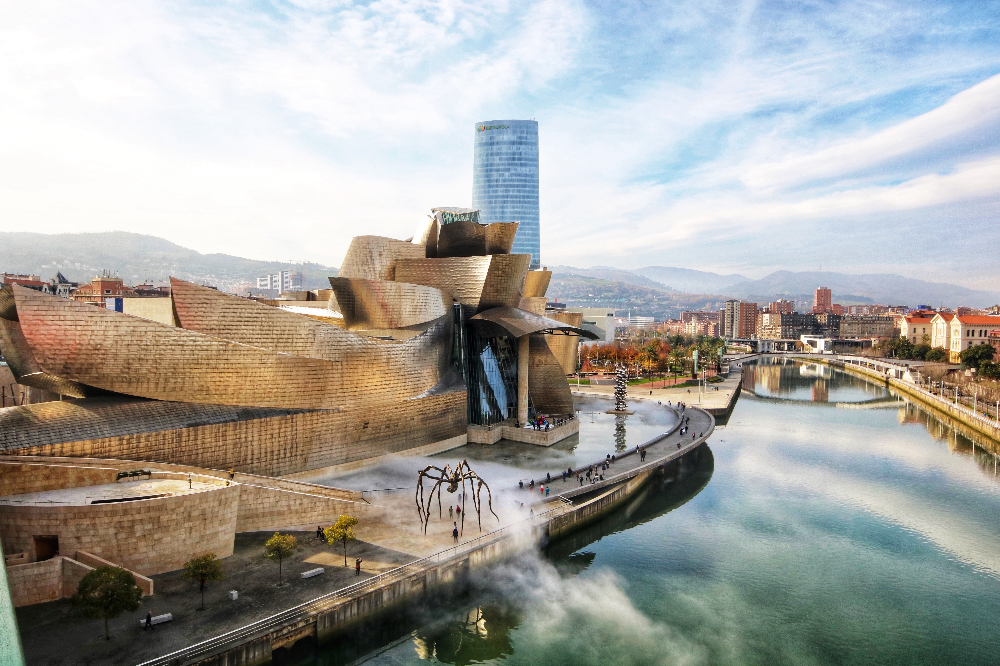
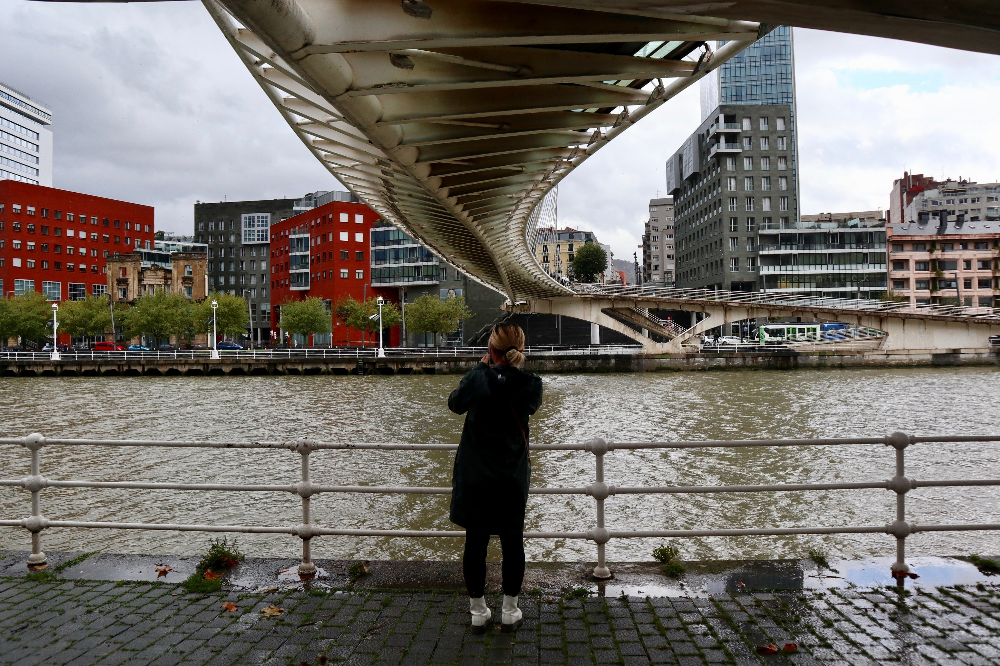

<style>
.list-group-item.active, .list-group-item.active:focus, .list-group-item.active:hover {
    background-color: #EA5933;
}
</style>

<style>
.nav>li>a {
    position: relative;
    display: block;
    padding: 10px 15px;
    color: #EA5933;
    font-weight: bold;
}
.nav-pills>li.active>a, .nav-pills>li.active>a:hover, .nav-pills>li.active>a:focus {
    color: white;
    background-color: #EA5933;
}
</style>


<script> 
    $(document).ready(function() { 
    $head = $('#header'); 
    $head.prepend('<A href = https://www.cuttingedge-events.com></A>') 
    }); 
</script> 


```{r echo=FALSE, message=FALSE,warning=FALSE}
library(readxl)
library(dplyr)
library(knitr)
```

# ACCOMMODATION

## Main Hotel: *Hotel Barcelo Nervion*

<iframe src="Barcelo Nervion/nervion.html" frameborder="0" width="100%" height="1300" scrolling="no"></iframe>


</br>
</br>


## Alternative Hotel: NYX BILBAO

<iframe src="Leonardo NXY  Bilbao/leonardo.html" frameborder="0" width="100%" height="1280" scrolling="no"></iframe>

</br>


## MAP


<iframe src="https://www.google.com/maps/d/embed?mid=1a3JoKBgGtw362Qwfuq5AVkw6MgJnwAk-&hl=es" width="100%" height="550"></iframe>


## TOURS OPTIONS {.tabset .tabset-fade .tabset-pills}

### San Sebastian Full day 
* **Duration** 10 hours 
* **Transport** Walking and public transport 
* **Participants** Minimum 10 pax maximum 25 pax  

Visiting only the city center of San Sebastian with old and new town, combined with a walk on the seaside or the beach would already justify your visit  -  but there is also the excellent food with some local specialities and -  of course  - some exceptional architectures we want to show to you:

**«Dealing with the natural surrounding»** is the common topic in the selected modern or historic architecture included in the tour - beeing the additional  highlights to the interesting and worthseeing Oldtown and Newtown

Most famous objects to see are:

**“Peine del viento”-  by E. Chillida and P. Ganchegui**  - an ensemble of sculptures, topographic urban architecture and beautiful landscape.

**Kursaal – by Rafael Moneo**  A building at the border between nature and urban city, built and arranged by the famous architect Rafael Moneo.

**San Telmo Museum – by Nieto and Sobejano**  Dismantled to its original structure by partial demolition, renovation and a cleverly added new extension, the San Telmo Museum presents itself as hidden architectural masterpiece of San Sebastian

**Club Náutico - by José Manuel Aizpurua** Like a white oceanliner the sailing club is located as icon of the international style in front of the old town.

Depending on the final itinerary,  it is possible to add more objects as the walk along the **Paseo Nuevo** with a **sculpture of J. Oteiza,** the city squares of the old town and the recently finished **Church at Riberas de Loiola – by Rafael Moneo**



### The “Bilbao-effect” and the Guggenheim museum
* **Duration** 10 hours 
* **Transport** Walking and public transport 
* **Participants** Minimum 10 pax maximum 25 pax  

There is a **long list of interesting modern architecture** which is worth a visit in Bilbao and its metropolitan area. 

Bilbao has passed a very impressive **change** in the last 25 years, from a derelict heavy industry area to one of the most prosperous and expensive areas of the contemporary Spain. 

On the other hand it is quite difficult to see and understand this remarkable changes in a today´s visit of the streets of Bilbao. 

We understand it as our mission to explain in our presentation speech and during our tours what has been done and achieved in the areas, even clearing up common misunderstandings as the overvaluation of the Guggenheim Museum for the development of the city.

Nevertheless it´s a must to see the **Guggenheim museum – Frank O. Gehry** ....the doubtless landmark of Bilbao.

In the timeframe of one day (f.ex. 9.00-19.00, 10h) we visit the city center with the important areas of **Abandoibarra** and the **newtown (Ensanche)** at the morning. After the lunchbreak we are going to the harbour with the famous transporter bridge visiting some remarkable buildings or areas on the way.

Some important objects to see are: 
**Abandoibarra:**
Pedestrian bridge Zubizuri - Santiago Calatrava Towers of Iribitarte - Arata Isozaki Abandoibarra -urban plan by Cesar Pelli,  university lecture building - Alvaro Siza), library of Deusto - Rafael Moneo; Melia Hotel ¨Legoretta & Legoretta Architects residencial Buildings - Carlos Ferrater, Iberdrola Tower - Cesar Pelli, Fine-Art Museum - Luis Mari Uriarte
**Ensanche:**
Metro stations - Norman Foster Local Governments Library - IMB Arquitectos Civic Center Alhondiga - Philippe Starck 
**Metropolitan Area:**
Ametzola train station - IMB Arquitectos Estadio Lasesarre - by Nomad/Eduardo Arroyo Plaza del Desierto - by Nomad/Eduardo Arroyo Plaza Pormetxeta - MTM/Xspiral

At the harbour the crowning final of the day is the **Transporter bridge** - UNESCO world heritage monument by Alberto Palacios/Francois Arnodin




**Important note** if the group is specialitst for example in sport centers, or museums, etc... we can do a tailor made tour according to the client needs. 


### Abandoibarra
* **Duration** 5 hours 
* **Transport** Walking and public transport 
* **Participants** Minimum 10 pax maximum 25 pax  

In the time-frame of a half-day-tour (4-5 hours) we offer this customized half-day-tour to the area of **Abandoibarra** - the new modern central area of Bilbao built in a former harbour area:

Starting with a general overview over the history of Bilbao in the recent 30 years we will zoom in: from **the urban masterplan of Cesar Pelli** into the long list of worthseeing particular buildings, as for example: :

* Euskalduna - F. Soriano y D. Palacios 
* Melia Hotel ¨Legoretta & Legoretta Architects 
* Fine-Art Museum -among others Luis Mari Uriarte 
* Plaza de Euskadi - Diana Balmori 
* Residencial Buildings - Carlos Ferrater, 
* Iberdrola Tower - Cesar Pelli 
* Paraninfo - university lecture building - Alvaro Siza 
* library of Deusto - Rafael Moneo 
* Pedro Arrupe pedestrian bridge - Ordoñez y Millanes

... and of course it´s a must to see the **Guggenheim museum** – Frank O. Gehry ....the doubtless landmark of Bilbao.

The customized Half-day-tour #1 Abandoibarra is a walking tour of 5 hours. The starting point will be adapted to the needs of the clients - the tour might start at the hotel of the clients or at a public meeting point as the  tramstop of the Euskalduna or the «Puppy» of Jeff Koons. The time-frame of a half-day is suitable to get a detailed insight view into the history and development of this «showroom» area of Bilbao.

The half-day-tour in Abandoibarra  can be added to one of the two other main topics in Bilbao: the Ensanche area («New Town» ) or the Metropolitan area.


### Ensanche Bilbao 
* **Duration** 5 hours 
* **Transport** Walking and public transport 
* **Participants** Minimum 10 pax maximum 25 pax  

The geometric «new town» of Bilbao was the big town extension started in the end of the 19th century - the «Ensanche» . In parts very geometric this part of the town has a very particular caracter due to its construction laws of heights and widths, the corner «towers» and the mixture of different construction styles from 1886 until today.

There is a **long list of interesting architecture** spread over all the Ensanche - from rationalistic buildings - including some residencial buildings of the so called «Bilbao rationalism» - and especially contemporary constructions as the outstanding metro stations

In the time-frame of a half-day-tour (4-5 hours) we offer this customized half-day-tour:

Starting with a short general overview over the history of Bilbao in the recent 30 years we will zoom into...

**Uribitarte Area:** 
* Pedestrian bridge Zubizuri - Santiago Calatrava 
* Towers of Iribitarte - Arata Isozaki
The first low-bound pedestrian bridge plus an contemporary ensemble of various volumes that form a new city entrance - directly linked to the primary geopmetric structure of the city.
* Plaza Moyua and Gran Via - the geometric city
* La Equitativa - Manuel Galindez the rationalist masterpiece in town
* Biblioteca de la Diputación - IMB Arquitectos 
* Residencial buildings of the «Bilbao rationism» 
* Civic center Alhondiga/ Azkuna Center - Ricardo Bastida/Philippe Starck
constructed initially as storage and trading facility for wine and tobacco it has been converted under direction of the worldfamous industrial designer Philippe Starck into a civic center .
* Metro stations Bilbao - Norman Foster timeless design: the perfect example of «rethinking architecture» and minimalism put into practice.

The customized Half-day-tour #2 Ensanche is a walking tour of 4-5 hours. The starting point will be adapted to the needs of the clients - the tour might start at the hotel of the clients or at a public meeting point as the tourist office at Abando roundabout. The time-frame of a half-day is suitable to get a detailed insight view into the history and development of this «new town» area of Bilbao.

The half-day-tour in the Ensanche can be added to one of the two other main topics in Bilbao: the Abandoibarra area (incl. Guggenheim)  or the Metropolitan area


### Metropolitan Area of Bilbao 
* **Duration** 5 hours 
* **Transport** Walking and public transport 
* **Participants** Minimum 10 pax maximum 25 pax 

The metropolitan area of Bilbao is one of the biggest urban aglomerations in Spain and has passed a very impressive **change** in the last 30 years: Bilbao is known for its noble areas int he center and the Guggenheim museum.

Starting in the town center we will move towards the harbour visiting two important development areas. After arriving to the harbour with the Transporter bridge we return to the city center by the metro.

There is a long list of worthseeing particular buildings, constructions and urban spaces, as for example: 

* Abando train station - addition by IMB Arquitectos 
* Variante Sur  - infratstructure project 
* Ametzola - urban development area 
* Urban Elevators  - IMB Arquitectos 
* Ametzola train station - IMB Arquitectos Barakaldo - Urban Galindo - development area *
* Lasesarre football stadium - Eduardo Arroyo/NOMAD 
* Desierto square - Eduardo Arroyo/NOMAD 
* Pormetxeta square - Xspiral/ MTM arquitectos 
* Transporter bridge - Alberto Palacios 
* Metro stations - Norman Foster

The starting point will be adapted to the needs of the clients - the tour might start at the hotel of the clients or at a public meeting point as the  Abando square inf front of the tourist office. 

The half-day-tour #3 Metropolitan area can be added to one of the two other main topics in Bilbao: the Abandoibarra area with the Guggenheim or the Ensanche area («New Town» )




END OF THE PROGRAMME

</br>

*****

# BUDGET


<iframe src="budgetparainsertar.html" frameborder="0" width="100%" height="800" scrolling="no"></iframe>

</br>


# TERMS AND CONDITIONS

  * Rates valid for 2021 util February 25th 2021
  
  * Net rates for A Company for a minimum of 10 attendees
  
  * Cutting Edge Events management fee including in the detailed rates
  
  * VAT included. 
  
  * No reservation has been done. Availability upon request.
  
*****


